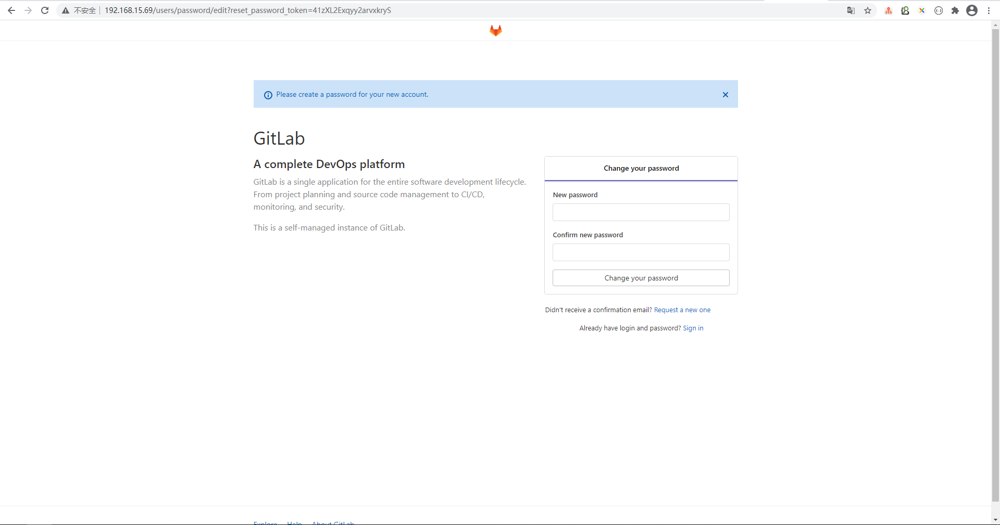
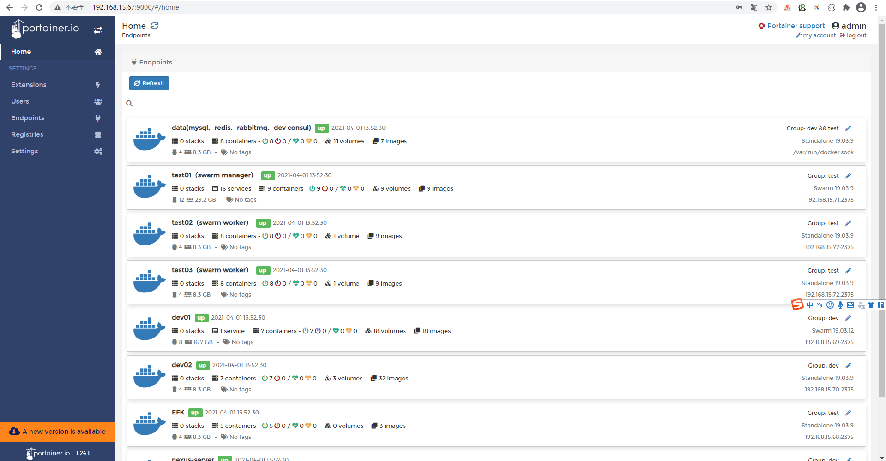

# 一、工具介绍

名称 | 描述
---|---
[gitlab](https://about.gitlab.com/) | 代码管理
[git runner](https://docs.gitlab.com/runner/) | gitlab内置的自动化部署工具
[harbor](https://github.com/goharbor/harbor) | docker镜像管理
[portainer](https://www.portainer.io/) | 管理docker的界面工具

# 二、软件安装
基于条件限制，可用的服务器仅有三台
服务器ip | 安装软件 | 用途 
---|---|---
192.168.15.67 | redis、mysql、seata、rabbitmq | 服务依赖的中间件
192.168.15.68 | elasticsearch、kibana | 收集日志
192.168.15.69 | gitlab、git runner、harbor、nexus、portainer | CI相关软件
## （一）服务依赖的中间件
### 1、redis
```
docker pull redis:5.0.5

docker run -d --name dev -p 6379:6379 -v /data/redis/dev/data:/data \
--restart=always redis:5.0.5 redis-server --appendonly yes --requirepass "123456"
```
### 2、mysql
```
docker pull mysql:5.7

创建挂载目录
sudo mkdir -p data/mysql/conf data/mysql/data data/mysql/logs

启动容器实例
docker run -d -p 3306:3306 --name dev -v /data/mysql/conf/my.cnf:/etc/mysql/conf.d/my.cnf \
 -v /data/mysql/logs:/var/log/mysql -v /data/mysql/data:/var/lib/mysql \
 --restart=always -e MYSQL_ROOT_PASSWORD=123456 mysql:5.7
```
### 3、rabbitmq
```
sudo docker pull rabbitmq:3.8.6-management

sudo docker run -d --name smart_cloud_rabbitmq -e RABBITMQ_DEFAULT_VHOST=smart_cloud_example_vhost -e RABBITMQ_DEFAULT_USER=collin -e RABBITMQ_DEFAULT_PASS=123456 -p 15672:15672 -p 5672:5672 -v /data/rabbitmq:/var/lib/rabbitmq -v /etc/localtime:/etc/localtime:ro --restart=always rabbitmq:3.8.6-management
```
### 4、seata
```
docker pull seataio/seata-server:latest

sudo docker run -d --name seata-server \
    -p 8091:8091 \
    -e SEATA_CONFIG_NAME=file:/root/seata-config/registry \
    -v /data/seata/config:/root/seata-config \
    -v /data/seata/log:/root/log/seata \
    -v /etc/localtime:/etc/localtime:ro \
    --restart=always \
	--privileged=true \
    seataio/seata-server:latest

备注：
    registry.conf 对应的是 default
    registry-dev.conf 对应 dev开发环境
    registry-test.conf 对应 test测试环境
    registry-prod.conf 对应 prod生产环境

创建/data/seata/config目录，并创建registry.conf、file.conf文件。
配置见/data/seata目录
```
## （二）日志收集（fluentd、elasticsearch、kibana）

名称 | 用途
---|---
fluentd | 收集日志
elasticsearch | 存储数据
kibana | 展示数据

### 1、fluentd安装
```
docker pull forkdelta/fluentd-elasticsearch

sudo docker service create --name smart_cloud_fluentd -p 24224:24224 -e TZ="Asia/Shanghai" --with-registry-auth --mode global --mount type=bind,src=/data/logs/application-logs,dst=/app/log --mount type=bind,src=/data/fluentd/config/fluentd.conf,dst=/fluentd/etc/fluent.conf --mount type=bind,src=/data/fluentd/config/,dst=/fluentd/data --network test --update-parallelism 1 --update-delay 20s forkdelta/fluentd-elasticsearch:latest

touch fluentd.log.mall-order.pos fluentd.log.mall-product.pos luentd.log.basic-user.pos


各节点配置见/data/fluentd目录
```

### 2、elasticsearch安装
```
搜索镜像获取最新版本号：docker search elasticsearch

docker pull elasticsearch:7.7.0


sudo docker run -d --name es-node1 -p 9201:9201 -p 9301:9301 -v /data/elasticsearch/data1:/usr/share/elasticsearch/data -v /data/elasticsearch/config1/elasticsearch.yml:/usr/share/elasticsearch/config/elasticsearch.yml -v /data/elasticsearch/plugins1:/usr/share/elasticsearch/plugins -e "ES_JAVA_OPTS=-Xms1024m -Xmx1024m" -e --restart=always -v /etc/localtime:/etc/localtime:ro elasticsearch:7.7.0

sudo docker run -d --name es-node2 -p 9202:9202 -p 9302:9302 -v /data/elasticsearch/data2:/usr/share/elasticsearch/data -v /data/elasticsearch/config2/elasticsearch.yml:/usr/share/elasticsearch/config/elasticsearch.yml -v /data/elasticsearch/plugins2:/usr/share/elasticsearch/plugins -e "ES_JAVA_OPTS=-Xms1024m -Xmx1024m" -e --restart=always -v /etc/localtime:/etc/localtime:ro elasticsearch:7.7.0

sudo docker run -d --name es-node3 -p 9203:9203 -p 9303:9303 -v /data/elasticsearch/data3:/usr/share/elasticsearch/data -v /data/elasticsearch/config3/elasticsearch.yml:/usr/share/elasticsearch/config/elasticsearch.yml -v /data/elasticsearch/plugins3:/usr/share/elasticsearch/plugins -e "ES_JAVA_OPTS=-Xms1024m -Xmx1024m" -e --restart=always -v /etc/localtime:/etc/localtime:ro elasticsearch:7.7.0


各节点配置见/data/elasticsearch目录
```

### 3、kibana安装
```
docker pull kibana:7.7.0

sudo docker run -d --restart=always --log-driver  json-file --log-opt max-size=1024m --log-opt max-file=2 --name smart_cloud_kibana -p 5601:5601 -v /data/kibana/config/kibana.yml:/usr/share/kibana/config/kibana.yml -e --restart=always kibana:7.7.0 


配置见/data/kibana/config/kibana.yml
```


## （三）CI
### 1、gitlab安装
```
docker pull gitlab/gitlab-ce:latest

docker run -d \
-p 18443:443 \
-p 80:80 \
-p 12222:22 \
--name gitlab \
--restart always \
--privileged=true \
-v /opt/gitlab/config:/etc/gitlab \
-v /opt/gitlab/logs:/var/log/gitlab \
-v /opt/gitlab/data:/var/opt/gitlab \
gitlab/gitlab-ce:latest


修改/opt/gitlab/config/gitlab.rb
sudo vim /opt/gitlab/config/gitlab.rb

将“external_url”设置为部署机器地址。如：external_url 'http://192.168.15.69'

访问地址：http://192.168.15.69
账号：root/12345678
```


### 2、git runner
```

```

### 3、harbor
```

```

###  4、portainer
```
docker pull portainer/portainer

sudo docker volume create portainer_data

sudo docker run -d -p 9000:9000 -p 8000:8000 --name portainer --restart=always -v /etc/localtime:/etc/localtime:ro -v /var/run/docker.sock:/var/run/docker.sock -v portainer_data:/data portainer/portainer


暴露docker2375端口
sudo vim /lib/systemd/system/docker.service
将原配置ExecStart=/usr/bin/dockerd -H fd:// --containerd=/run/containerd/containerd.sock
修改为ExecStart=/usr/bin/dockerd -H fd:// -H tcp://0.0.0.0:2375 --containerd=/run/containerd/containerd.sock

即新增内容：-H tcp://0.0.0.0:2375

sudo systemctl daemon-reload
sudo service docker restart
```


# 三、gitlab ci脚本编写

