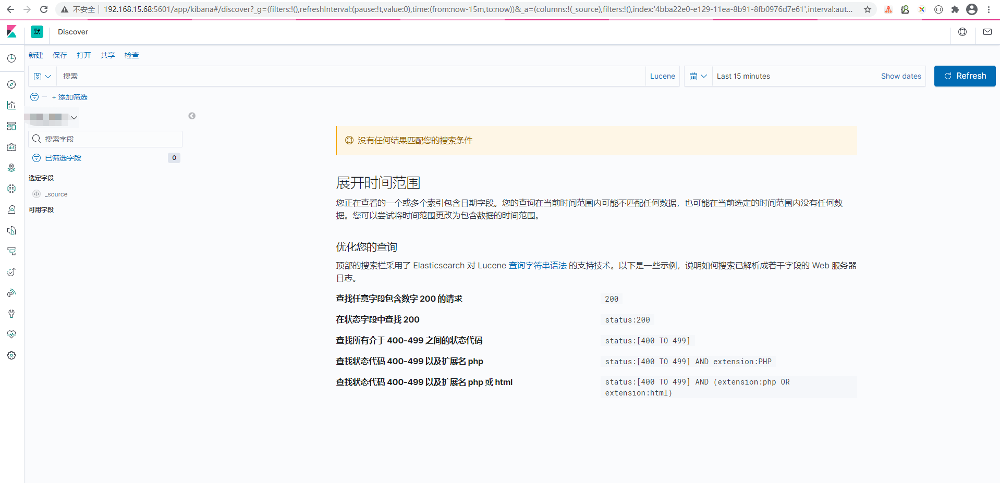

# 一、工具介绍

名称 | 描述
---|---
[gitlab](https://about.gitlab.com/) | 代码管理
[git runner](https://docs.gitlab.com/runner/) | gitlab内置的自动化部署工具
[harbor](https://github.com/goharbor/harbor) | docker镜像管理
[portainer](https://www.portainer.io/) | 管理docker的界面工具

# 二、工具安装
## （一）gitlab
```
docker pull gitlab/gitlab-ce
docker network create gitlab_net

docker run -d \
-p 18443:443 \
-p 80:80 \
-p 12222:22 \
--name gitlab \
--restart always \
--privileged=true \
-v /opt/gitlab/config:/etc/gitlab \
-v /opt/gitlab/logs:/var/log/gitlab \
-v /opt/gitlab/data:/var/opt/gitlab \
docker.io/beginor/gitlab-ce:11.0.1-ce.0
```

## （二）harbor
```

```

## （三）portainer
### 1、安装
```
docker pull portainer/portainer

sudo docker volume create portainer_data

sudo docker run -d -p 9000:9000 -p 8000:8000 --name portainer --restart always -v /etc/localtime:/etc/localtime:ro -v /var/run/docker.sock:/var/run/docker.sock -v portainer_data:/data portainer/portainer
```
### 2、暴露docker2375端口
```
sudo vim /lib/systemd/system/docker.service
将原配置ExecStart=/usr/bin/dockerd -H fd:// --containerd=/run/containerd/containerd.sock
修改为ExecStart=/usr/bin/dockerd -H fd:// -H tcp://0.0.0.0:2375 --containerd=/run/containerd/containerd.sock

即新增内容：-H tcp://0.0.0.0:2375

sudo systemctl daemon-reload
sudo service docker restart
```


# 三、gitlab ci脚本编写

# 四、日志收集（fluentd、elasticsearch、kibana）

名称 | 用途
---|---
fluentd | 收集日志
elasticsearch | 存储数据
kibana | 展示数据

## （一）安装 
### 4.1 fluentd安装
```
docker pull forkdelta/fluentd-elasticsearch

sudo docker service create --name smart_cloud_fluentd -p 24224:24224 -e TZ="Asia/Shanghai" --with-registry-auth --mode global --mount type=bind,src=/data/logs/application-logs,dst=/app/log --mount type=bind,src=/data/fluentd/config/fluentd.conf,dst=/fluentd/etc/fluent.conf --mount type=bind,src=/data/fluentd/config/,dst=/fluentd/data --network test --update-parallelism 1 --update-delay 20s forkdelta/fluentd-elasticsearch:latest

touch fluentd.log.mall-order.pos fluentd.log.mall-product.pos luentd.log.basic-user.pos


各节点配置见/data/fluentd目录
```

### 4.2 elasticsearch安装
```
搜索镜像获取最新版本号：docker search elasticsearch

docker pull elasticsearch:7.7.0


sudo docker run -d --name es-node1 -p 9201:9201 -p 9301:9301 -v /data/elasticsearch/data1:/usr/share/elasticsearch/data -v /data/elasticsearch/config1/elasticsearch.yml:/usr/share/elasticsearch/config/elasticsearch.yml -v /data/elasticsearch/plugins1:/usr/share/elasticsearch/plugins -e "ES_JAVA_OPTS=-Xms1024m -Xmx1024m" -e --restart=always -v /etc/localtime:/etc/localtime:ro elasticsearch:7.7.0

sudo docker run -d --name es-node2 -p 9202:9202 -p 9302:9302 -v /data/elasticsearch/data2:/usr/share/elasticsearch/data -v /data/elasticsearch/config2/elasticsearch.yml:/usr/share/elasticsearch/config/elasticsearch.yml -v /data/elasticsearch/plugins2:/usr/share/elasticsearch/plugins -e "ES_JAVA_OPTS=-Xms1024m -Xmx1024m" -e --restart=always -v /etc/localtime:/etc/localtime:ro elasticsearch:7.7.0

sudo docker run -d --name es-node3 -p 9203:9203 -p 9303:9303 -v /data/elasticsearch/data3:/usr/share/elasticsearch/data -v /data/elasticsearch/config3/elasticsearch.yml:/usr/share/elasticsearch/config/elasticsearch.yml -v /data/elasticsearch/plugins3:/usr/share/elasticsearch/plugins -e "ES_JAVA_OPTS=-Xms1024m -Xmx1024m" -e --restart=always -v /etc/localtime:/etc/localtime:ro elasticsearch:7.7.0


各节点配置见/data/elasticsearch目录
```

### 4.3 kibana安装
```
docker pull kibana:7.7.0

sudo docker run -d --restart=always --log-driver  json-file --log-opt max-size=1024m --log-opt max-file=2 --name smart_cloud_kibana -p 5601:5601 -v /data/kibana/config/kibana.yml:/usr/share/kibana/config/kibana.yml -e --restart=always kibana:7.7.0 


配置见/data/kibana/config/kibana.yml
```

## （二）效果图

